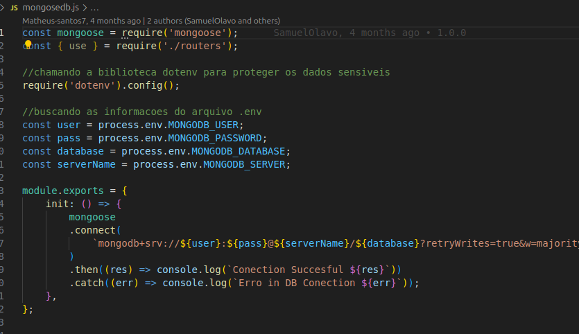

# [API AGENDAMENTO](https://api-siand-esqe.onrender.com/)
<h3>Api para gestao de agendamento da Clinica SIAND</h3>


> A Agenda Api é uma plataforma integrada com o formulario de atendimento, que permite o cadastro dos serviços que serao ofertados, o gerenciamento de forma inteligente dos agendamentos e o tratamento do perfil do usuário de maneira eficiente.

<!-- ### Ajustes e melhorias

O projeto ainda está em desenvolvimento e as próximas atualizações serão voltadas nas seguintes tarefas:

- [x] Tarefa 1
- [x] Tarefa 2
- [x] Tarefa 3
- [ ] Tarefa 4
- [ ] Tarefa 5 -->

## 💻 Pré-requisitos

Antes de começar, verifique se você atendeu aos seguintes requisitos:

- Instalar as dependencias do repositorio `< npm install >`
- Criar um banco de dados no [MongoDB](https://cloud.mongodb.com/).  
<!-- - Sistema desenvolvido em NodeJS. `<Windows / Linux / Mac>`. -->
<!-- - Você leu `<guia / link / documentação_relacionada_ao_projeto>`. -->


## 🚀 Instalando <API-SIAND>

Para instalar o API-SIAND, siga estas etapas:

Linux Windows e macOS:
Com o repositorio baixado utilize o Visual Studio para implantar as dependencias que se encontram listadas no package.json do projeto com o comando abaixo.

```
<npm install>
```

Apos instalar as dependencias é necessario fazer o apontamento do banco de dados MongoDB criado na plataforma, lembre de compartilhar o acesso ao banco por dentro da plataforma cloud.mongodb.
Utilize o arquivo mongosedb.js que se encontra na raiz do src para preencher os dados do banco criado (voce pode criar o arquivo .env para gravação de dados sensiveis).




O projeto pode ser iniciado pelo VS com o comando abaixo;

```
<npm start>
```

## ☕ Usando <API-SIAND>

Para usar API-SIAND, siga estas etapas:

Fazer agendamento: O cliente com acesso à internet precisa de acessar o [formulario](http://localhost:3000/old%20formulario.html), localizar a página de agendamento, preencher seus dados pessoais, escolher entre os serviços listados, data e horário desejado e enviar o formulário.

Controlar os Serviços: O Usuário com acesso à internet se autentica na página de [login](http://localhost:3000/login.html) da plataforma Agenda-Api, clica na página de serviços, e preenche a descrição do serviço e clica em incluir, esse serviço vai ser adicionado no [formulário](http://localhost:3000/old%20formulario.html) de agendamento.

Controlar os agendamentos: O Usuário com acesso à internet se autentica na página de [login](http://localhost:3000/login.html) da plataforma Agenda-Api, clica na página de agendamento onde lhe permite ver (imprimir) e gerir (editar, cadastrar e excluir) toda lista de agendamentos feitos no seu nome.

Gestão de usuário: O Usuário com acesso à internet se autentica na página de [login](http://localhost:3000/login.html) da plataforma Agenda-Api, clica na página de perfil onde lhe permite ver, editar e excluir os seus dados cadastrados no sistema.


Video de apresentação do projeto: https://drive.google.com/file/d/1JoKi65Hc_2d1HBoozD0E-5IPRUlSiDi0/view

## 🤝 Colaboradores

Agradecemos às seguintes pessoas que contribuíram para este projeto:

<table>
  <tr>
    <td align="center">
      <a href="#" title="defina o titulo do link">
        <br>
        <sub>
          <b>Matheus Santos</b>
        </sub>
      </a>
    </td>
  </tr>
</table>
